# 🚗 IoT Race Car - Complete Project Documentation

**Project Name:** Bluetooth-Controlled Race Car with Obstacle Avoidance  
**Microcontroller:** ESP32 Dev Module  
**Date:** December 28, 2025  
**Status:** Documentation & Planning Phase

---

## 📑 Table of Contents
1. [System Architecture](#system-architecture)
2. [Hardware Components](#hardware-components)
3. [Pin Configuration](#pin-configuration)
4. [Component Wiring Diagram](#component-wiring-diagram)
5. [Software Architecture](#software-architecture)
6. [Main Loop Flow](#main-loop-flow)
7. [Communication Protocol](#communication-protocol)
8. [State Machine](#state-machine)
9. [Function Specifications](#function-specifications)
10. [Testing Strategy](#testing-strategy)

---

## 🏗️ System Architecture


---

## 🔧 Hardware Components

### **1. ESP32 Dev Module**
- **Function:** Main microcontroller
- **Features:**
  - Dual-core 240MHz processor
  - Built-in Bluetooth Classic & BLE
  - 34 GPIO pins
  - PWM support on all digital pins
  - 5V tolerant (with level shifters)
- **Power:** 5V via USB or VIN pin
- **Operating Voltage:** 3.3V logic

### **2. L298N Motor Driver**
- **Function:** H-Bridge motor controller
- **Specifications:**
  - Dual H-bridge circuit
  - Max motor voltage: 46V
  - Peak current: 2A per channel
  - Logic voltage: 5V
  - PWM frequency support: 0-40kHz
- **Connections:**
  - IN1-IN4: Direction control
  - ENA, ENB: Speed control (PWM)
  - OUT1-OUT4: Motor terminals

### **3. HC-SR04 Ultrasonic Sensor**
- **Function:** Distance measurement
- **Specifications:**
  - Range: 2cm - 400cm
  - Accuracy: ±3mm
  - Measuring angle: 15°
  - Trigger: 10µs pulse
  - Echo: Returns pulse width
  - Power: 5V, <15mA
- **Formula:** Distance (cm) = Echo Time (µs) / 58

### **4. Active Buzzer**
- **Function:** Audible warning for obstacle detection
- **Type:** Active buzzer (has built-in oscillator)
- **Specifications:**
  - Operating Voltage: 3-5V DC
  - Current Draw: ~20-30mA
  - Sound Level: ~85dB at 10cm
  - Frequency: ~2kHz (fixed)
  - Polarity: Positive (+) and Negative (-)
- **Resistor Required:** ❌ **NO** - ESP32's 3.3V GPIO is safe for most active buzzers
- **Note:** If buzzer is rated for 5V only, use a 100Ω resistor to limit current

### **5. DC Motors (x2)**
- **Function:** Vehicle propulsion
- **Specifications:**
  - Voltage: 3V - 12V
  - Recommended: 6V - 7.4V
  - Current: ~200-300mA each (no load)
  - Speed control via PWM
  - Bidirectional operation

### **6. Power Supply**
- **ESP32:** USB cable (5V, 500mA) or external 5V source
- **Motors:** 7.4V LiPo battery (2S) or 6x AA batteries
- **Common Ground:** Essential for all components

---

## 📌 Pin Configuration


### **Pin Assignment Table**

| Component | Pin Name | ESP32 GPIO | Signal Type | Description |
|-----------|----------|------------|-------------|-------------|
| **Left Motor** | IN1 | GPIO 16 | Digital Out | Forward control |
| | IN2 | GPIO 17 | Digital Out | Backward control |
| | ENA | GPIO 4 | PWM Out | Speed control (0-255) |
| **Right Motor** | IN3 | GPIO 18 | Digital Out | Forward control |
| | IN4 | GPIO 19 | Digital Out | Backward control |
| | ENB | GPIO 5 | PWM Out | Speed control (0-255) |
| **Ultrasonic** | TRIG | GPIO 13 | Digital Out | 10µs trigger pulse |
| | ECHO | GPIO 12 | Digital In | Distance echo signal |
| **Buzzer** | + (Positive) | GPIO 14 | Digital Out | Warning alarm signal |
| | - (Negative) | GND Pin | Ground | Buzzer ground |
| **Power** | 5V | 5V Pin | Power | Logic & sensor power |
| | GND | GND Pin | Ground | Common ground |

---

## 🔌 Component Wiring Diagram


### **Wiring Checklist**
- [ ] ESP32 powered via USB (5V)
- [ ] ESP32 GND → L298N GND → HC-SR04 GND → Battery GND (common ground)
- [ ] ESP32 5V → L298N 5V logic pin
- [ ] ESP32 5V → HC-SR04 VCC
- [ ] Battery 7.4V → L298N +12V motor power
- [ ] All 6 motor control pins (IN1-IN4, ENA, ENB) connected
- [ ] Both ultrasonic pins (TRIG, ECHO) connected
- [ ] Buzzer positive (+) to GPIO 14, negative (-) to GND
- [ ] Left motor to OUT1 & OUT2
- [ ] Right motor to OUT3 & OUT4

---

## 💻 Software Architecture


---

## 🔄 Main Loop Flow


---

## 📡 Communication Protocol

```mermaid
sequenceDiagram
    participant App as Dabble App
    participant BT as Bluetooth Module
    participant ESP as ESP32 Controller
    participant Sensor as HC-SR04
    participant Motors as Motor Driver
    
    App->>BT: Gamepad Button Press (Forward)
    BT->>ESP: Dabble.processInput()
    ESP->>ESP: Read Gamepad State
    ESP->>ESP: Store Command
    
    ESP->>Sensor: Trigger Pulse (10µs)
    Sensor->>ESP: Echo Response
    ESP->>ESP: Calculate Distance
    
    alt Distance >= 20cm (Safe)
        ESP->>Motors: Execute Forward Command
        Motors->>Motors: Both Motors Forward
        Note over ESP,Motors: Car moves forward
    else Distance < 20cm (Obstacle)
        ESP->>Motors: Emergency Stop
        Motors->>Motors: Both Motors Stop
        ESP->>ESP: Activate Buzzer (HIGH)
        Note over ESP: Audible warning beeps
        ESP->>ESP: Print "OBSTACLE! STOPPED"<br/>to Serial Monitor
        Note over ESP: Debug message for<br/>developer monitoring
    end
    
    Note over ESP: Loop repeats continuously<br/>No delay, non-blocking
```



### **Dabble Gamepad Command Mapping**

| Dabble Button | Command | Action | Motor States |
|---------------|---------|--------|--------------|
| **Up Arrow** | Forward | Move forward | Left: FWD, Right: FWD |
| **Down Arrow** | Backward | Move backward | Left: BACK, Right: BACK |
| **Left Arrow** | Left | Turn left | Left: STOP, Right: FWD |
| **Right Arrow** | Right | Turn right | Left: FWD, Right: STOP |
| **No Button Pressed** | Stop | Stop all motors | Both: STOP |

**Note:** Commands are read from Dabble's Gamepad module. The ESP32 continuously checks button states via `Dabble.processInput()`.

### **Bluetooth Messages**
- **From ESP32 (via Serial Monitor):**
  - `"IoT Race Car Ready!"` - System startup
  - `"OBSTACLE! STOPPED"` - Obstacle detected
  - `"Command: X"` - Command confirmation (optional debug)

**Note:** Status messages are sent to Serial Monitor for debugging. The Dabble app displays real-time gamepad input but does not receive text feedback from ESP32.

---

## 🎯 State Machine


---

## ⚙️ Function Specifications

### **1. Setup Functions**

```cpp
void setup()
```
**Purpose:** Initialize all hardware components and communication  
**Actions:**
- Initialize Serial Monitor (115200 baud)
- Initialize Dabble Bluetooth with device name "IoT_RaceCar" using `Dabble.begin()`
- Set all motor pins as OUTPUT
- Set ultrasonic pins (TRIG: OUTPUT, ECHO: INPUT)
- Set buzzer pin as OUTPUT
- Stop all motors (safe initial state)
- Print ready message for debugging

---

### **2. Sensor Functions**

```cpp
long getDistance()
```
**Purpose:** Measure distance using HC-SR04 ultrasonic sensor  
**Returns:** Distance in centimeters (long)  
**Algorithm:**
1. Set TRIG pin LOW (2µs)
2. Set TRIG pin HIGH (10µs)
3. Set TRIG pin LOW
4. Measure ECHO pulse duration using `pulseIn()`
5. Calculate: distance = duration / 58
6. Return distance value

**Non-blocking:** Uses `pulseIn()` with timeout to prevent hanging

---

### **3. Motor Control Functions**


#### **a) void stopCar()**
```
IN1 = LOW
IN2 = LOW
IN3 = LOW
IN4 = LOW
ENA = MOTOR_SPEED (PWM active)
ENB = MOTOR_SPEED (PWM active)
```

#### **b) void moveForward()**
```
Left Motor:  IN1 = HIGH, IN2 = LOW (Forward)
Right Motor: IN3 = HIGH, IN4 = LOW (Forward)
ENA = MOTOR_SPEED
ENB = MOTOR_SPEED
```

#### **c) void moveBackward()**
```
Left Motor:  IN1 = LOW, IN2 = HIGH (Reverse)
Right Motor: IN3 = LOW, IN4 = HIGH (Reverse)
ENA = MOTOR_SPEED
ENB = MOTOR_SPEED
```

#### **d) void turnLeft()**
```
Left Motor:  IN1 = LOW, IN2 = LOW (Stop)
Right Motor: IN3 = HIGH, IN4 = LOW (Forward)
ENA = MOTOR_SPEED
ENB = MOTOR_SPEED
```

#### **e) void turnRight()**
```
Left Motor:  IN1 = HIGH, IN2 = LOW (Forward)
Right Motor: IN3 = LOW, IN4 = LOW (Stop)
ENA = MOTOR_SPEED
ENB = MOTOR_SPEED
```

#### **f) void activateBuzzer()**
```
digitalWrite(BUZZER_PIN, HIGH)
// Turns buzzer ON - produces continuous beep
// Called when obstacle detected
```

#### **g) void deactivateBuzzer()**
```
digitalWrite(BUZZER_PIN, LOW)
// Turns buzzer OFF - silence
// Called when path is clear
```

---

### **4. Communication Functions**

```cpp
// Process Dabble input (call in main loop)
Dabble.processInput();

// Read gamepad commands
if (GamePad.isUpPressed()) {
    lastCommand = 'F';  // Forward
} else if (GamePad.isDownPressed()) {
    lastCommand = 'B';  // Backward
} else if (GamePad.isLeftPressed()) {
    lastCommand = 'L';  // Left
} else if (GamePad.isRightPressed()) {
    lastCommand = 'R';  // Right
} else {
    lastCommand = 'S';  // Stop
}

// Send status message (to Serial Monitor)
Serial.println("OBSTACLE! STOPPED");
```

---

## 🧪 Testing Strategy


### **Test Cases**

#### **Phase 1: Component Tests**
1. **Dabble Bluetooth Connection Test**
   - Install Dabble app on Android/iOS device
   - Upload code to ESP32 and open Serial Monitor
   - Open Dabble app and enable Bluetooth
   - Select "IoT_RaceCar" from device list
   - Open Gamepad module in Dabble app
   - Press buttons and verify Serial Monitor shows command reception
   - Verify ESP32 responds to button presses

2. **Ultrasonic Sensor Test**
   - Place object at known distance (10cm, 20cm, 30cm)
   - Print distance values to Serial Monitor
   - Verify accuracy within ±3cm

3. **Motor Control Test**
   - Test each function individually: F, B, L, R, S
   - Verify correct rotation direction
   - Check PWM speed control
   - Measure current draw (should be <500mA per motor)

4. **Buzzer Test**
   - Set buzzer pin HIGH in setup, verify sound
   - Set buzzer pin LOW, verify silence
   - Test continuous beeping (on/off cycle)
   - Verify buzzer audible from 3+ meters

#### **Phase 2: Integration Tests**
5. **Command Execution Test**
   - Press each button on Dabble gamepad (Up, Down, Left, Right)
   - Verify correct motor response for each direction
   - Release button and verify car stops
   - Check command persistence (car continues movement while button held)

6. **Obstacle Detection Test**
   - Press forward button on Dabble gamepad
   - Place hand at 25cm - car should move forward
   - Place hand at 15cm - car should stop immediately
   - Verify "OBSTACLE! STOPPED" message in Serial Monitor
   - **Verify buzzer sounds when obstacle detected**
   - **Verify buzzer stops when obstacle removed**

7. **Emergency Stop Test**
   - Press forward button on Dabble gamepad
   - Move obstacle into path (<20cm)
   - Verify immediate stop (response time <100ms)
   - **Verify buzzer activates immediately**
   - Remove obstacle and verify car can move again

#### **Phase 3: System Tests**
8. **Continuous Operation Test**
   - Run for 10 minutes with random commands
   - Verify no crashes or hangs
   - Check for memory leaks

9. **Response Time Test**
   - Measure command-to-action latency
   - Measure obstacle detection latency
   - Target: <50ms for both

10. **Edge Cases Test**
   - Very close obstacles (2-5cm)
   - Objects at maximum range (400cm)
   - Rapid command changes
   - Continuous forward with obstacle

#### **Phase 4: Race Track Tests**
11. **Track Navigation**
    - Test on actual race track
    - Navigate corners and straightaways
    - Verify no false obstacle detections

12. **Turn Accuracy**
    - Measure turn radius
    - Adjust motor speeds if needed
    - Test left/right turn consistency

13. **Speed Tuning**
    - Adjust MOTOR_SPEED constant
    - Find optimal speed for:
      - Maximum velocity
      - Control precision
      - Battery efficiency

---

## 🔢 Constants & Configuration

```cpp
// Pin Definitions
#define MOTOR_LEFT_IN1    16
#define MOTOR_LEFT_IN2    17
#define MOTOR_LEFT_ENA    4
#define MOTOR_RIGHT_IN3   18
#define MOTOR_RIGHT_IN4   19
#define MOTOR_RIGHT_ENB   5
#define ULTRASONIC_TRIG   13
#define ULTRASONIC_ECHO   12
#define BUZZER_PIN        14

// Configuration Constants
#define STOPPING_DISTANCE_CM  20    // Obstacle detection threshold
#define MOTOR_SPEED          200    // PWM value (0-255)
#define SERIAL_BAUD         115200  // Debug monitor speed
#define BT_DEVICE_NAME "IoT_RaceCar" // Bluetooth name
#define PULSE_TIMEOUT       30000   // Ultrasonic timeout (µs)
```

### **Tunable Parameters**

| Parameter | Default | Range | Purpose |
|-----------|---------|-------|---------|
| `STOPPING_DISTANCE_CM` | 20 | 5-50 | Obstacle safety margin |
| `MOTOR_SPEED` | 200 | 100-255 | Motor PWM duty cycle |
| `PULSE_TIMEOUT` | 30000 | 20000-40000 | Sensor timeout (µs) |

---

## 📊 Performance Specifications


### **Expected Performance**
- **Command Response Time:** <50ms (from Bluetooth receive to motor action)
- **Obstacle Detection Time:** <100ms (from object approach to stop)
- **Main Loop Frequency:** >100Hz (>100 cycles per second)
- **Bluetooth Range:** ~10 meters (line of sight)
- **Ultrasonic Range:** 2cm - 400cm (effective: 5-200cm)
- **Battery Runtime:** 20-40 minutes (depends on battery capacity)
- **Motor Speed Control:** 0-255 PWM levels
- **Turn Radius:** ~30-50cm (depends on speed and turn logic)

---

## 🚨 Safety Features


1. **Obstacle Priority Override:** Distance check has absolute priority over all commands
2. **Safe Initial State:** Motors stopped in setup before accepting commands
3. **Common Ground:** All components share common ground to prevent electrical issues
4. **PWM Speed Limiting:** Maximum speed capped at safe level
5. **Non-blocking Code:** No delays in main loop ensures instant obstacle response
6. **Battery Protection:** Separate motor battery prevents ESP32 brownouts
7. **Timeout Protection:** Ultrasonic sensor has timeout to prevent code hanging

---

## 🛠️ Troubleshooting Guide


### **Common Issues & Solutions**

| Problem | Possible Cause | Solution |
|---------|---------------|----------|
| Can't connect to Dabble | Code not uploaded / wrong name / library not installed | Re-upload code, install DabbleESP32 library, check device name in Dabble app |
| Dabble buttons not working | Library not initialized / processInput() not called | Ensure Dabble.begin() in setup() and Dabble.processInput() in loop() |
| Motors not spinning | No battery power / loose wires | Check 7.4V battery, verify all connections |
| One motor not working | Loose connection / dead motor | Check specific motor wiring and connections |
| Wrong motor direction | Reversed polarity | Swap motor wires at L298N terminals |
| Sensor always 0 | No power / wrong pins | Verify 5V to sensor, check TRIG/ECHO pins |
| ESP32 keeps resetting | Motors drawing too much current | Use separate battery for motors |
| Car won't move forward | Obstacle always detected | Check sensor readings in Serial Monitor |
| Slow response | Code has delays | Remove all delay() from main loop |

---

## 📦 Bill of Materials (BOM)

| Qty | Component | Specifications | Approx. Cost |
|-----|-----------|----------------|--------------|
| 1 | ESP32 Dev Module | 38-pin, USB-C preferred | $6-10 |
| 1 | L298N Motor Driver | Dual H-Bridge | $3-5 |
| 2 | DC Geared Motors | 3-12V, with wheels | $5-10 |
| 1 | HC-SR04 Ultrasonic | Distance sensor | $2-3 |
| 1 | Active Buzzer | 3-5V DC, 85dB | $1-2 |
| 1 | 7.4V LiPo Battery | 2S, 1000-2500mAh | $10-20 |
| 1 | Battery Connector | XT60 or JST | $1-2 |
| 1 | Chassis | Acrylic or 3D printed | $5-15 |
| 1 | USB Cable | Micro-USB or USB-C | $2-5 |
| 20 | Jumper Wires | Male-to-Male & Male-to-Female | $2-5 |
| 1 | Breadboard (optional) | For prototyping | $2-5 |
| | **Total Estimated Cost** | | **$41-82** |

---

## 📚 Required Libraries

```cpp
#include <DabbleESP32.h>  // External library for Dabble app integration
```

**Installation:** 
1. Open Arduino IDE
2. Go to **Sketch → Include Library → Manage Libraries**
3. Search for **"DabbleESP32"**
4. Install the library by **STEMpedia** (or **Dabble**)
5. Alternatively, download from GitHub: https://github.com/STEMpedia/DabbleESP32

**Note:** The DabbleESP32 library handles all Bluetooth communication with the Dabble mobile app, including gamepad input processing.

### **Arduino IDE Setup**
1. Install ESP32 board support:
   - File → Preferences
   - Additional Board Manager URLs: `https://dl.espressif.com/dl/package_esp32_index.json`
   - Tools → Board → Boards Manager → Search "ESP32" → Install

2. Install DabbleESP32 library:
   - Sketch → Include Library → Manage Libraries
   - Search "DabbleESP32" → Install

3. Select board:
   - Tools → Board → ESP32 Arduino → ESP32 Dev Module

4. Configure settings:
   - Upload Speed: 115200
   - Flash Frequency: 80MHz
   - Partition Scheme: Default

### **Dabble Mobile App Setup**
1. **Download Dabble App:**
   - Android: Google Play Store
   - iOS: App Store (if available)
   - Search for "Dabble" by STEMpedia

2. **Connect to ESP32:**
   - Power on ESP32
   - Open Dabble app on mobile device
   - Enable Bluetooth on mobile device
   - Tap "Connect" in Dabble app
   - Select "IoT_RaceCar" from device list
   - Wait for connection confirmation

3. **Using Gamepad Module:**
   - In Dabble app, select "Gamepad" module
   - Use directional arrows to control the car
   - Up = Forward, Down = Backward, Left = Turn Left, Right = Turn Right

---

## 🎓 Key Concepts

### **1. H-Bridge Motor Control**
An H-Bridge allows bidirectional motor control using 4 switches (transistors):

```
Forward:  IN1=HIGH, IN2=LOW  → Current flows Motor+ to Motor-
Backward: IN1=LOW,  IN2=HIGH → Current flows Motor- to Motor+
Stop:     IN1=LOW,  IN2=LOW  → No current flow
Brake:    IN1=HIGH, IN2=HIGH → Short circuit (NOT USED)
```

### **2. PWM (Pulse Width Modulation)**
Controls motor speed by rapidly switching power on/off:
- **Duty Cycle:** Percentage of time signal is HIGH
- **0 (0%):** Motor off
- **128 (50%):** Half speed
- **255 (100%):** Full speed
- **Frequency:** ESP32 default ~5kHz

### **3. Ultrasonic Distance Measurement**
Uses sound wave travel time:
1. Send 10µs trigger pulse
2. Sensor emits 8x 40kHz ultrasonic pulses
3. Measure echo pulse width
4. Formula: Distance = (Echo Time × Speed of Sound) / 2
5. Simplified: Distance (cm) = Echo Time (µs) / 58

### **4. Non-blocking Programming**
Ensures continuous sensor monitoring:
- ❌ **Bad:** `delay(1000)` - blocks all execution
- ✅ **Good:** Check sensors every loop cycle
- Result: Instant obstacle response even during movement

---

## 📝 Next Steps - Implementation Checklist

- [x] Requirements analysis complete
- [x] Hardware component selection
- [x] Pin configuration designed
- [x] Software architecture planned
- [x] Flowcharts and diagrams created
- [ ] **Create Arduino .ino file with DabbleESP32 library**
- [ ] **Write motor control functions**
- [ ] **Implement sensor reading**
- [ ] **Implement main loop logic**
- [ ] **Upload and test on hardware**
- [ ] **Calibrate sensors and motors**
- [ ] **Race track testing**

---

## 🏁 Ready for Implementation

This documentation provides complete specifications for building the IoT Race Car. All components, connections, logic flow, and testing procedures are defined. 

**The next step is to create the actual Arduino code file implementing this design.**

---

**Document Version:** 1.0  
**Last Updated:** December 28, 2025  
**Status:** ✅ Planning Complete - Ready for Code Implementation
